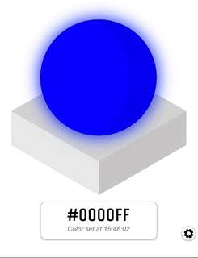

# GlowOrb Emulator
An Electron app for emulating [Andy Stanford-Clark's](http://stanford-clark.com/) [GlowOrb](https://designsparkmarketplace.com/en/listings/617-gloworb).



## Overview

This app is a macOS application for emulating the behaviour of a Gloworb - an IoT connected device for ambient display of information. When running, the emulator will connect to a user-defined public MQTT broker and subscribe to user-defined MQTT Topic. If a message is emitted on this topic with a valid hex color, the emulator will set it's color to the color passed.

GlowOrb's are great for demonstrating IoT applications, but you may not always have one to hand, so this emulator will behave as a real GlowOrb would if a valid message is passed to it.

## Usage

When run, the emulator will first show you the settings panel where you can configure the connection for the MQTT broker that your emulator will attempt to connect and subscribe to.

At a minimum, you will need the `mqtt://` address for the MQTT broker that will be emitting colors for your GlowOrb to be, and the topic that those messages are being published on. 

By default, the emulator will try to connect to the broker on port 1883. If your broker is listening for connections on another port, you can set that in the setting too.

If you have a secured broker, you can also pass a username, password, and client ID to establish a connection.

Once you've set the values in the form, hit the "Save Settings" button and the emulator will attempt to connect and subscribe to the broker / topic. While the connection is being established, a black dialog will appear saying "Connecting..."

If successful, the "Connecting..." message will be replaced with "Connected" which will soon dissapear to show the GlowOrb.

Now, whenever a valid hex color is received on the subscribed to topic, the GlowOrb Emulator will update to reflect the color published.

To change the saved settings, click the cog to the bottom right of the emulator to show the settings form again.

## Quickstart with Node-RED

To get started quickly, you import the below flow into a Node-RED instance and publish events to a public broker (in this case, [iot.eclipse.org](mqtt://iot.eclipse.org)).

To import, copy the following JSON text.

```json
[{"id":"def111da.719d5","type":"mqtt out","z":"7e9313e4.62ba4c","name":"Eclipse Public Broker","topic":"","qos":"0","retain":"","broker":"efc46a04.2ab5d8","x":490,"y":510,"wires":[]},{"id":"ae0ff234.e1b79","type":"inject","z":"7e9313e4.62ba4c","name":"Set Green","topic":"","payload":"#00FF00","payloadType":"str","repeat":"","crontab":"","once":false,"onceDelay":0.1,"x":240,"y":510,"wires":[["def111da.719d5"]]},{"id":"7303d073.c7eb1","type":"inject","z":"7e9313e4.62ba4c","name":"Set Blue","topic":"","payload":"#0000FF","payloadType":"str","repeat":"","crontab":"","once":false,"onceDelay":0.1,"x":240,"y":555,"wires":[["def111da.719d5"]]},{"id":"2b849bfa.240f44","type":"inject","z":"7e9313e4.62ba4c","name":"Set Red","topic":"","payload":"#FF0000","payloadType":"str","repeat":"","crontab":"","once":false,"onceDelay":0.1,"x":250,"y":465,"wires":[["def111da.719d5"]]},{"id":"efc46a04.2ab5d8","type":"mqtt-broker","z":"","name":"","broker":"iot.eclipse.org","port":"1883","clientid":"","usetls":false,"compatmode":true,"keepalive":"60","cleansession":true,"birthTopic":"","birthQos":"0","birthPayload":"","closeTopic":"","closeQos":"0","closePayload":"","willTopic":"","willQos":"0","willPayload":""}]
```

1. Head to your Node-RED dashboard.
2. Click the hamburger menu icon in the top-right of your display.
3. Go to import > clipboard
4. Paste the contents of your clipboard into the dialog that appears.
5. Click import. You will now see some nodes appear that you're able to move around with your mouse.
6. Click to set the position of your newly imported nodes.

Once imported, you'll need to set a custom MQTT topic that you will publish your colors to, and that your GlowOrb will subscribe to. Try to make it unique, otherwise you may accidentally recieve colors that other users are publishing on the same topic. To do so, follow these steps:

1. Double-click on the purple MQTT node called "Eclipse Public Broker" that you just imported
2. A configuration panel will appear. Click in the "topic" input field.
3. Enter a unique topic that your emualator will subscribe to to recieve hex colors. I like using something like `/GlowOrbEmulator/seans-unique-emulator-name`, but it can be anything you like.
4. Click "Done", and then click "Deploy" in the top-right of your Node-RED UI.

Your Node-RED instance should connect to the Eclipse IoT MQTT Broker and will be able to publish hex colors on the topic you've defined.

Head back to your emulator and open up your settings panel by clicking on the cog. Enter the following details in your emulator to establish the connection.

1. MQTT Broker: `mqtt://iot.eclipse.org`
2. MQTT Port: `1883`
3. MQTT Topic: `<THE UNIQUE TOPIC NAME YOU SET IN NODE-RED>`

Then click "Save Settings". Now, if you head back to Node-RED and click one of the inject nodes in your flow, your GlowOrb Emulator should change to that color!

You're all set to go! 🎉

